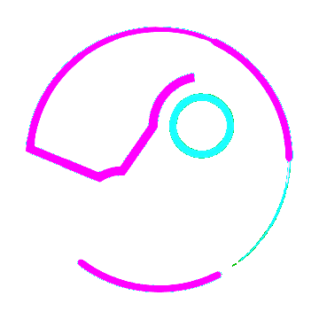

<h1 align="center"> Hi there I'm Nikhil  </h1>

<h3 align="center">A Full-stack developer, open-source contributor and Engineering student with a strong love for coding.</h3>

 

<h2> About me: </h2>

 

- Working on weebook 
- Currently learning DSA 
- MERN stack developer 
- Competitive programming hobbyist 
- Curious about everything
- Gaming aficionado. 
- Cinematographer and adroit guitarist 

 

<h2>Languages and Tools:</h2>

 

<ul>
        <!--
               ♦
         -->
        
        &nbsp;&nbsp;
        
        &nbsp;&nbsp;
        
         
        <!--
               ♦
         -->
        
        &nbsp;&nbsp;
        
        &nbsp;&nbsp;
        
         
        <!--
               ♦
         -->
        
        &nbsp;&nbsp;
        
        &nbsp;&nbsp;
        
        &nbsp;&nbsp;
        
         
        <!--
               ♦
         -->
        
        &nbsp;&nbsp;
        
        &nbsp;&nbsp;
        
        
         
        <!--
               ♦
         -->
        
        &nbsp;&nbsp;
        
        &nbsp;&nbsp;
        
         
        <!--
               ♦
         -->
        
        &nbsp;&nbsp;
        
        &nbsp;&nbsp;
        
</ul>

 

<h2>Contact:</h2>

 
 
<ul>
         
        <!--
               ▖
         -->
        
        &nbsp;&nbsp;
        
        &nbsp;&nbsp;
        
        &nbsp;&nbsp;
        
</ul>

 

<h2>Github stats:</h2>

 

 

        
        
</p
